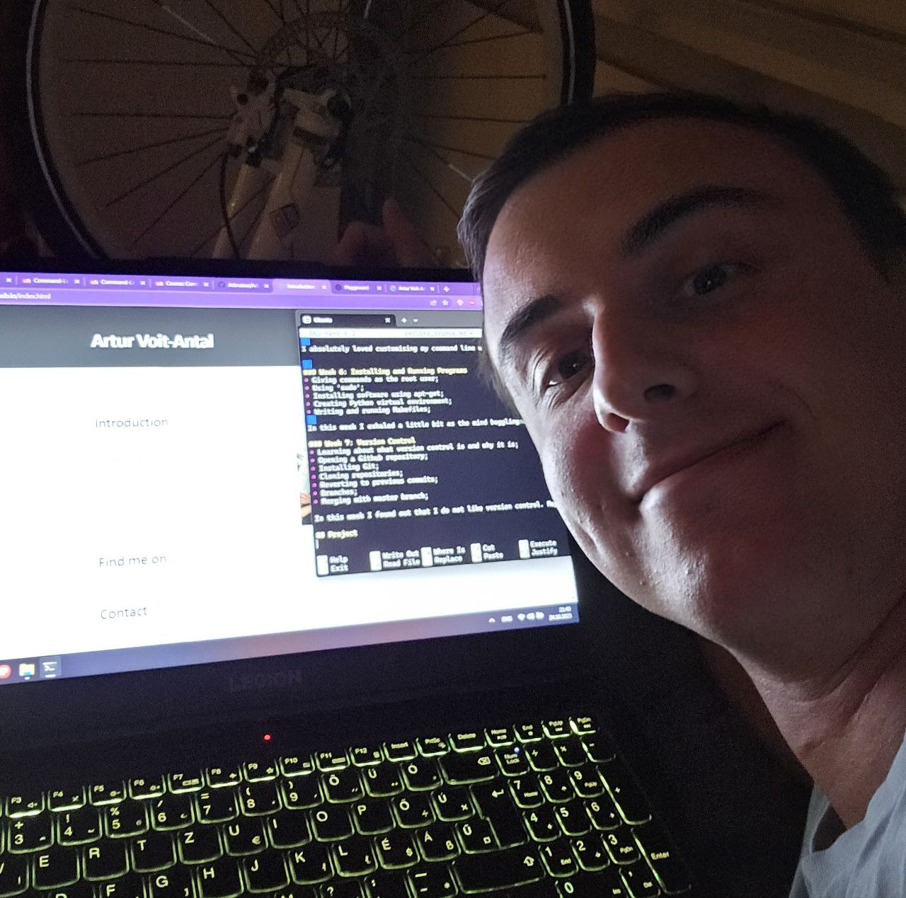

## Well, well, well, look who came to read about what I've learned in the command line course

## Introduction
In this course, I delved into the intricacies of the command-line environment, learning what Linux is all about and what you can do with it. The course was a thrilling journey where I found myself gaining valuable knowledge and enjoying the content.
 
 
### Week 1: Introduction to Command Line Environments
* Setting up command line (Ubuntu, in my case);
* Privacy and users in Linux;
* Text editing with Nano;
* Basic Linux commands like ls and less;  
 
This week was a nice and gentle start, without too much technical detail as soon as we started.  

### Week 2: Navigating a UNIX System
* We learned how to copy, move and remove directories;
* Root directory;
* SSH and scp;
* gzip and tar;
* PIDs of processes;
* Running commands in the background;

This week was filled with many quite different topics, but they were not too complicated on their own and pretty easily digestible.  

### Week 3: Basic Corpus Processing
* ASCII, Latin-1 and utf-8 encoding systems;
* converting encoding of text files;
* 'Head' and 'tail' commands;
* Sorting lines in a document;
* Lower casing;
* Removing duplicate lines;
* Searching for patterns;
* Cutting and pasting columns in text files;  

This week was a great introduction to working with text.  

### Week 4: Advanced Corpus Processing
* Deleting lines from documents using 'sed' command;
* Finding and replacing patterns using 'sed';
* Regex with sed;
* Using pipes with;
* Generating frequency lists;
* Generating sentence per line documents;
* Transforming text files into N-grams;  

> Regex is magic!  
-everyone who gets to understand regex  

This was probably my favourite week because I really enjoy working with text. It was very demanding, but equally useful. I was also really motivated because I know how crucial such basic text transformations are in NLP, so I really enjoyed getting to know how to do these things outside of Python.  
  
### Week 5: Scripting and Configuration Files
* Writing simple scripts;
* Accessing command line parameters in scripts;
* If statements and while loops;
* Command substitution;
* Looking up variables with 'echo';
* Making permanent changes in .bashrc;
* Creating a pleasant command line environment;
  
I absolutely loved customising my command line with the command line constructor, it was really fun. The scripts were a bit mind boggling at times, but it's not easy to scare me.
  
### Week 6: Installing and Running Programs
* Giving commands as the root user;
* Using 'sudo';
* Installing software using apt-get;
* Creating Python virtual environment;
* Writing and running Makefiles;
  
In this week I exhaled a little bit as the mind bogglingness was almost absent. I'm no longer scared of the phrase "virtual environment" which is another great achievement. 

### Week 7: Version Control
* Learning about what version control is and why it is;
* Opening a Github repository;
* Installing Git;
* Cloning repositories;
* Reverting to previous commits;
* Branches;
* Merging with master branch;

In this week I found out that I do not like version control. Maybe I need to have my very own tiny project. The fact that Github just hosts your website is amazing though. Cloning is amazing.

## Project
This is how this website came to be.  

In this picture you can see me writing this page 20 minutes before my bedtime before I go to Stockholm with my friends tomorrow :)  
  

In this project I brought together all the knowledge that I collected throughout the course. It's pretty shocking how much I've learned in just 2 months. Sometimes I had to spend literally 2-3 days going through all the readings, videos and tasks, but it was well worth it.  
  
I'm honestly amazed that you can learn how to make a simple website and then also implement it in less than one day. And that day also includes teaching 3 English lessons.  

| Phase | Description | Honest Feeling | Unexpected Moments |
| ----- | ----------- | -------------- | ------------------ |
| Idea Generation | Chose what to make my website about | Scared and brave at the same time | Realised that making websites is not witchcraft |
| Development | Actually sat down to write code | Discovered newfound respect for web designers | Remembered everything but how to insert a forced line break |
| Reflection | Looking back at the journey of just one day | Mesmerised by computers | Became sleepy |
