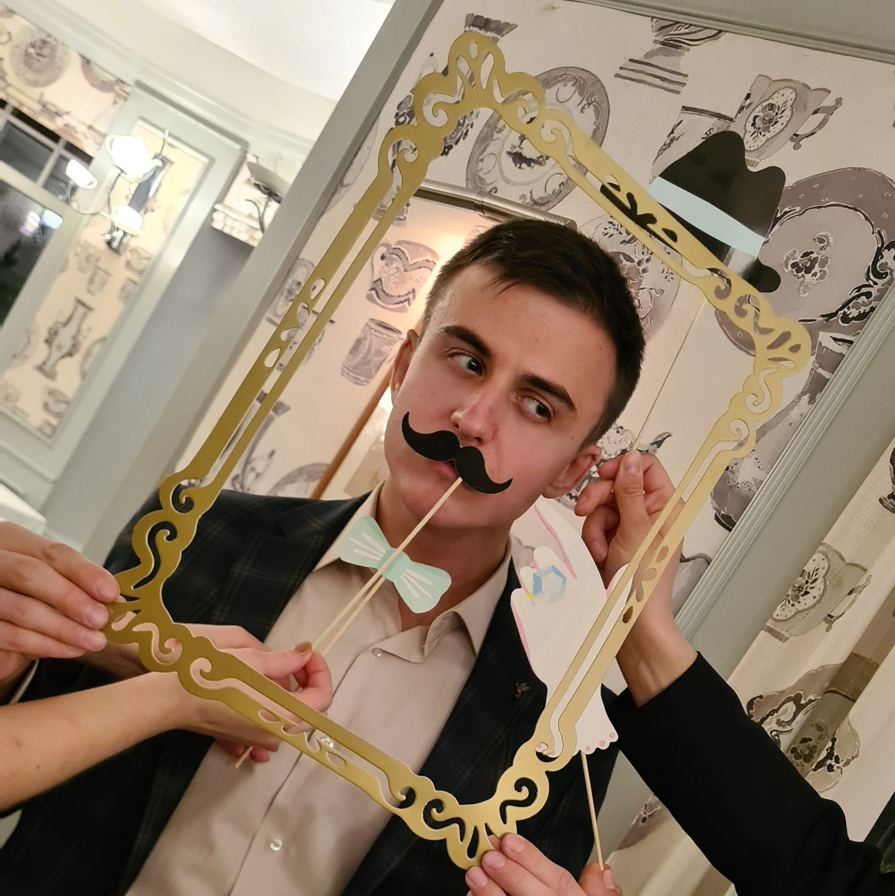

## Introduction

 Motivated by a strong interest in the intersection of **language and technology**, I have dedicated my academic and professional journey to linguistics and am now transitioning towards the exciting field of Natural Language Processing. The chance to utilise my solid background in linguistics in applied NLP is incredibly inspiring to me. My foundation in linguistics, coupled with my proven fast learning abilities demonstrated by my consistently high grades, are crucial assets in reaching my goal of making a significant contribution to the NLP field.  

## CV
To view click [**here**](https://drive.google.com/file/d/18mrBGRjgsrw2ZGcRII3zt8lApYruSASJ/view?usp=sharing)

## Find me on

[LinkedIn](https://www.linkedin.com/in/artur-voit-antal-862b5b247/), [GitHub](https://github.com/Arbruiser)  

## Contact

My email address is _arturvoi@helsinki.fi_  

## Courses I've Taken

[Command-Line Tools for Linguists](https://studies.helsinki.fi/courses/course-implementation/hy-opt-cur-2324-261401a1-c550-4436-91b9-7edf4a1a3b57/KIK-LG221), fall 2023

[Auditory discrimination and phonetic notation](https://studies.helsinki.fi/courses/course-implementation/hy-opt-cur-2324-2ca11ffd-699e-41d5-84cf-524439f86e5b/LDA-P303), fall 2023

[Introduction to Linguistic Diversity and Digital Humanities](https://studies.helsinki.fi/courses/course-implementation/hy-opt-cur-2324-9df97501-21e6-4b8d-9de4-e91303f2ff71/LDA-301), fall 2023
  
#### **Random Fun Fact:** Did you know that a 'jiffy' is an actual unit of time for 1/100th of a second?
  
## Projects
* [Naïve Bayes for text classification](https://docs.google.com/document/d/1oO0tMGtc-Xdq4qrhnAJCAOtXx9vSO5S3d9PnYdaZDcU/edit?usp=sharing) - unpublished literature review which was written for my application to study at the University of Helsinki. Yes, I wrote a whole paper to get in, talk about motivation;  
* [Simple search engine in Python](https://colab.research.google.com/drive/1mT2zuut_F0_fQqGe4ViHAgXyJEeAa9-E?usp=sharing) - part of my Natural Language Processing course I took in spring of 2023. The course is part of Computer Science MSc;  
* [Part of Speech tagger with a classical sequence tagging model](https://colab.research.google.com/drive/1rgMKQAliFU5K2a61UENazN3sghFgR5rL?usp=sharing) - part of my Natural Language Processing course I took in spring of 2023. The course is part of Computer Science MSc;  
* [Language teaching courses in MOOCs](https://drive.google.com/file/d/1yEk2obJPFnKVZJSUTybXU1p9x6mZXzQ-/view?usp=sharing) - my Bachelor's thesis;  
* [GitHub project (you are here)](https://arbruiser.github.io/) - a website I created for myself as part of the "Command line tools for linguists" course.

## Misc. 
>Linguistics and NLP are cool  
-me
  
>I'm not blessed with artistic talent, and it shows on this website  
-also me 

